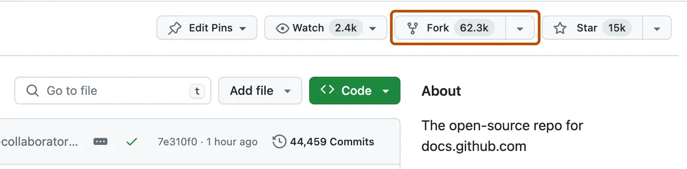

# How to Fork and Clone the Psi4 GitHub Repository

Forking and cloning a GitHub repository allows you to make changes to the
codebase without directly affecting the original repository. Follow these steps
to fork and clone the Psi4 repository, so you have a starting point for future
tutorials and research projects!

## 1. Fork the Repository

Forking a repository creates a copy of the original repository under your own GitHub account.

### Steps to Fork:
1. **Navigate to the [Psi4 Repository](https://github.com/psi4/psi4).**
2. **Sign in to GitHub (if you aren't already).**
3. **Click the "Fork" button** at the top-right corner of the repository page.


## 2. Clone the Repository

Cloning means creating a local copy of the repository from GitHub to your computer.

### Steps to Clone:

1. **Navigate to your forked repository** on your GitHub account. The URL will
   be `https://github.com/<YOUR_USERNAME>/psi4`.
2. **Click the "Code" button** to open the clone options.


3. **Copy the URL** provided under the HTTPS tab. It will look like this:
   `https://github.com/<YOUR_USERNAME>/psi4.git`


### Using Git Command Line

Open your terminal and execute the following command:

```bash
git clone https://github.com/<YOUR_USERNAME>/psi4.git
```

This will create a local copy of the repository on your computer.

## 3. Verify the Clone

Once the clone is complete, navigate into the project directory:

```bash
cd psi4
```

To ensure everything is set up correctly, you can list the contents of the
directory:

```bash
ls
```

You should see the folder structure of the Psi4 project.

## 4. Setting Up the Upstream Remote

To keep your fork up to date with the original repository, you may want to set
up an upstream remote.

### Steps to Add Upstream Remote:

1. **Navigate to your local repository** and run the following command:

    ```bash
    git remote add upstream https://github.com/psi4/psi4.git
    ```

2. **Verify** the new upstream remote:

    ```bash
    git remote -v
    ```

    You should see two remote URLs: one for your origin (your fork) and one for the upstream (the original repository).

## Conclusion

You have successfully forked and cloned the Psi4 GitHub repository! You can now
make changes to your local copy, push them to your fork, and create pull
requests to contribute to the original project (we will discuss this more going
forward).

If you have any questions or run into any issues, please check out the issues
page to see if there are any solutions
[Psi4 Developer Introduction
Issues](https://github.com/Awallace3/psi4_developer_introduction/issues) or ask
a question in the new dev channel on[Psi4's Slack
Group](https://join.slack.com/t/psi4/shared_invite/zt-5s36s4rb-SQH6_AWyfWOqlKYN3cFs4Q)

# Next Tutorial
Now you are ready to [build Psi4 from
source](../building_psi4_from_source/building_psi4_from_source.md)
